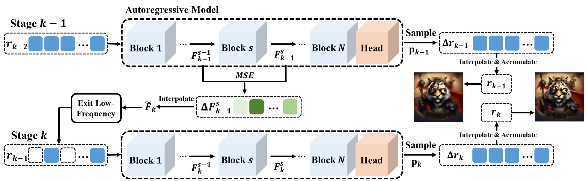

# Frequency-Aware Autoregressive Modeling for Efficient High-Resolution Image Synthesis

> **📌 ICCV 2025 | Official Code Release Coming Soon**  
> This repository hosts the official implementation of our ICCV 2025 paper:  
> **"Frequency-Aware Autoregressive Modeling for Efficient High-Resolution Image Synthesis"**  
> 🔥 Up to **2× speedup** for high-res image synthesis with minimal quality drop.

---

## 🔍 Abstract

> Visual autoregressive modeling, based on the next-scale prediction paradigm, exhibits notable advantages in image quality and model scalability over traditional autoregressive and diffusion models. It generates images by progressively refining resolution across multiple stages. However, the computational overhead in high-resolution stages remains a critical challenge due to the substantial number of tokens involved.
>
> In this paper, we introduce **SparseVAR**, a plug-and-play acceleration framework for next-scale prediction that dynamically excludes low-frequency tokens during inference without requiring additional training. [...]
>
> SparseVAR achieves **up to a 2× speedup** with **minimal quality degradation** in **Infinity-2B**.

---

## 🖼️ Method


📄 **Method Diagram:**  


<!-- For inline image display after converting PDF to PNG -->
<!--  -->

---

## 💡 Highlights

- ✅ **No retraining required**  
- ⚡ **Skips low-frequency tokens dynamically**  
- 🧩 **Compatible with HART, Infinity, and other next-scale models**  
- 🚀 **Achieves up to 2× speedup** in inference


<!--
---

## 📦 Code Release Plan

Planned release contents:

- [ ] Inference code with token skipping
- [ ] Pretrained checkpoints
- [ ] Scripts & documentation
- [ ] Evaluation and visualization tools -->

<!--## 📄 Citation

```bibtex
@inproceedings{chen2025frequencyaware,
  title     = {Frequency-Aware Autoregressive Modeling for Efficient High-Resolution Image Synthesis},
  author    = {Zhuokun Chen and Jugang Fan and Zhuowei Yu and Bohan Zhuang and Mingkui Tan},
  booktitle = {Proceedings of the IEEE/CVF International Conference on Computer Vision (ICCV)},
  year      = {2025}
}-->
